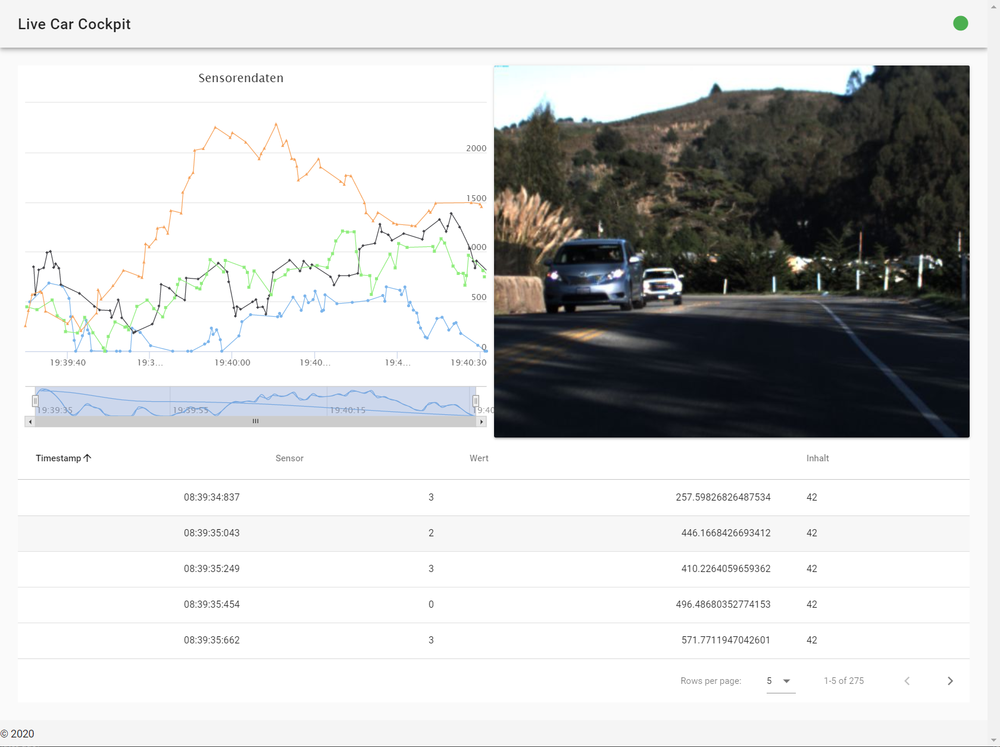

# Live Car Cockpit - A demo project

This was an demo project I built for an application. It should represent live data being sent from a car to a Cockpit which visualizes the data. The backend and frontend are connected via a websocket connection and a sequence of images is being sent. The sensor data is randomly generated. The frontend is built with Vue + Vuetify while the backend uses Spring Boot.



## How to run

```
cd frontend
npm run build
cd ..
mvn package
java -jar target/live_car_cockpit-1.0-SNAPSHOT.jar

# open localhost:8080
```

The images used in this repo are from the [Udacity self-driving-car dataset](https://github.com/udacity/self-driving-car/tree/master/datasets/CH2) (MIT License).
